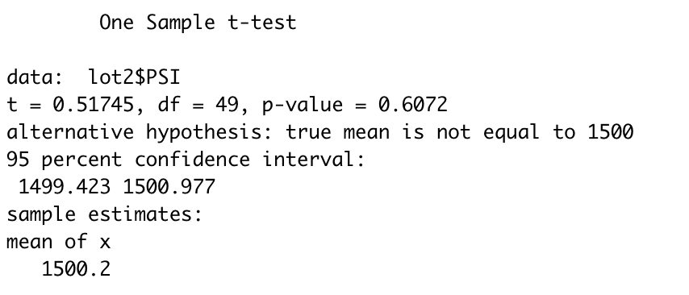

# MechaCar_Statistical_Analysis

## Project Overview
A few weeks after starting his new role, Jeremy is approached by upper management about a special project. AutosRUs’ newest prototype, the MechaCar, is suffering from production troubles that are blocking the manufacturing team’s progress. AutosRUs’ upper management has called on Jeremy and the data analytics team to review the production data for insights that may help the manufacturing team.

In this challenge, you’ll help Jeremy and the data analytics team do the following:

- Perform multiple linear regression analysis to identify which variables in the dataset predict the mpg of MechaCar prototypes
- Collect summary statistics on the pounds per square inch (PSI) of the suspension coils from the manufacturing lots
- Run t-tests to determine if the manufacturing lots are statistically different from the mean population
- Design a statistical study to compare vehicle performance of the MechaCar vehicles against vehicles from other manufacturers. For each statistical analysis, you’ll write a summary interpretation of the findings.

## Linear Regression to Predict MPG

In the Above output, we are able to tell that:
- Vehicle length and vehicle ground clearance provide non-random amounts of variance to the model statistically. Both have an impact on miles per gallon (mpg) for the MachaCar prototype. Alternatively, the other three (vehicle weight, spoiler angle, and AWD-All Wheel Drive) have p-values that distribute a random amount of vairance within the dataset.
- The p-value we are working with is smaller than the assumed significance level of 0.05%. What this tells us is that we can reject the null hypothesis because we have enough evidence to do so, confirming that the slope is not zero.
- Looking at the r-squared value of this linear model, we can determine that 0.7149 (approximately 72%) of the mpg predictions will be determined by this model. Based on this, we can confirm that this model does predict mpg of MechaCar pprototypes effectively.

## Summary Statistics on Suspension Coils

When we look at all of the manufacturing lots and whetherthe design fits the specifications for MechaCar suspension coils, we notice that the variance of the coils is approximately 62.3 PSI, which it well within the 100 PSI variance requirement. Because of this, the current manufacturing data does meet the design specification of 100 pounds per square inch for all manufacturing lots in total.

When we break the lots down to their prospective lots (1, 2 & 3) we notice that lot 1 (0.98 variance) and lot 2 (7.47 variance) are most certainly within the 100 PSI vairance requirement. Lot 3, however, has a much higher variance (170.29 variance). With this variance so high, it is causing a disproportionate variance at the full lot reading. In other words, this means that the current manufacturing data does not meet the design specification of 100 pounds per square inch for each lot individually.

## T-Tests on Suspension Coils

### Sample t-test

### Sample t-test: lot1

### Sample t-test: lot2

### Sample t-test: lot3

## Challenge Sumary
